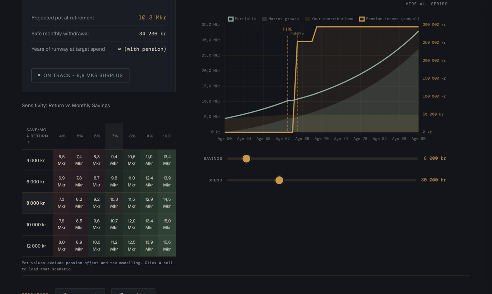
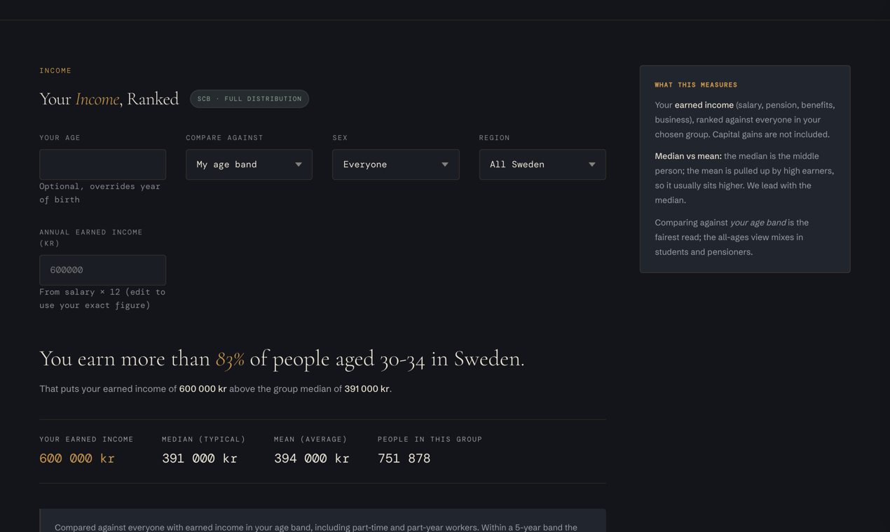
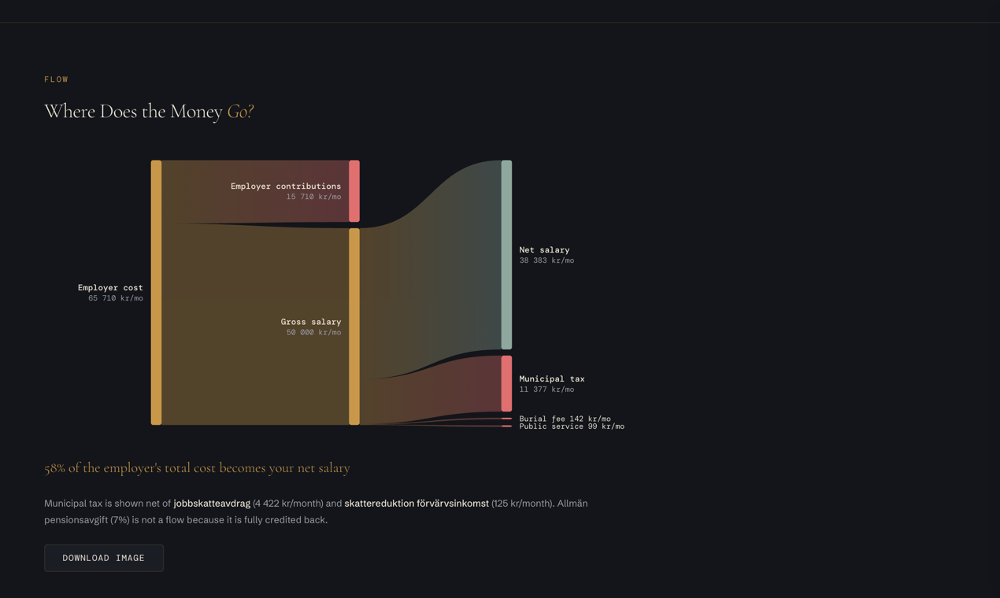
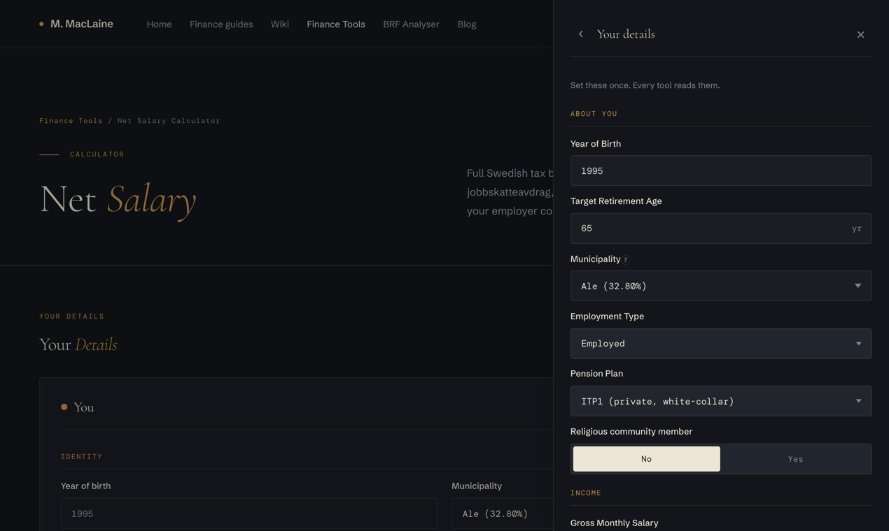

# MacLaine Finance

**30+ free Swedish personal-finance calculators. No login, no tracking.**

**Live at [maclaine.se/en/finance](https://maclaine.se/en/finance)** (English) / [maclaine.se/finance](https://maclaine.se/finance) (Swedish)

MacLaine Finance is a free suite of 30+ personal-finance calculators for Sweden. It covers net salary, job offers, occupational and state pension, FIRE planning, ISK and fund fees, mortgages, capital gains, student loans (CSN), parental leave, sick pay, unemployment insurance and more, tied together by an interactive decision flowchart, a 78-article wiki and 32 in-depth guides. Every tool shares one profile: type your salary once and every calculator uses it. The entire suite is client-side JavaScript with no backend, no accounts and no tracking of financial data; inputs stay in the browser's localStorage. Calculations follow 2026 Swedish tax rules and are verified against Skatteverket's technical specifications. Available in Swedish and English. Built and maintained by Matthew MacLaine in Stockholm.

## Start here

- **[The Decision Flowchart](https://maclaine.se/en/finance/flowchart)**: an interactive "what should I do with my money?" decision tree for Sweden, from emergency buffer to mortgage amortisation to ISK vs pension. If you only open one page, open this one.
- **[FIRE Projection](https://maclaine.se/en/finance/fire)**: your path to financial independence with Swedish pensions (tjänstepension, allmän pension) modelled properly, not bolted on.
- **[The hub](https://maclaine.se/en/finance)**: all tools on one page.

## A look at it

| | |
|---|---|
|  |  |
| **[FIRE projection](https://maclaine.se/en/finance/fire)** with Swedish pensions modelled in, plus a return-vs-savings sensitivity matrix | **[Where do I stand?](https://maclaine.se/en/finance/benchmark)** Your income ranked against real Swedish distribution data |
|  |  |
| **[Where does the money go?](https://maclaine.se/en/finance/salary)** From employer cost to net take-home in one flow | **[Type your details once.](https://maclaine.se/en/finance)** Every tool reads the same shared profile, stored only in your browser |

## The tools

### Tax and salary

| Tool | What it does |
|---|---|
| [Net Salary](https://maclaine.se/en/finance/salary) | Full Swedish tax breakdown: grundavdrag, jobbskatteavdrag, municipal and state tax |
| [Job Offer](https://maclaine.se/en/finance/jobberbjudande) | Value an offer (net, pension, vacation) and see where it sits on the salary distribution |
| [Municipality Tax](https://maclaine.se/en/finance/skattejamforelse) | Compare your net salary across all 290 Swedish municipalities |
| [Salary Sacrifice](https://maclaine.se/en/finance/lonevaxling) | Löneväxling trade-off: net pay lost vs pension gained |
| [3:12 Calculator](https://maclaine.se/en/finance/3-12) | Gränsbelopp and salary vs dividend for fåmansbolag owners under the 2026 rules |
| [Tax Return](https://maclaine.se/en/finance/deklaration) | Refund or kvarskatt for 2026: your final tax and the statutory reductions |
| [ROT & RUT](https://maclaine.se/en/finance/rotrut) | Renovation and household-services deductions with per-person cap tracking |
| [SINK Tax](https://maclaine.se/en/finance/sink) | Net pay under SINK (flat tax for non-residents) vs ordinary taxation |
| [Capital Gains Tax](https://maclaine.se/en/finance/kapitalvinst) | K4 gains and losses, kvittning, schablonmetoden |
| [IBB Thresholds](https://maclaine.se/en/finance/ibb) | Where your salary sits against the 7.5×IBB pension ceiling and skiktgräns |

### Pension and retirement

| Tool | What it does |
|---|---|
| [FIRE Projection](https://maclaine.se/en/finance/fire) | Path to financial independence: safe withdrawal rate and runway |
| [Public Pension](https://maclaine.se/en/finance/allman-pension) | Inkomstpension, premiepension and garantipension estimates |
| [Occupational Pension](https://maclaine.se/en/finance/pension) | ITP1, ITP2 and other plans: growth, contributions, drawdown |
| [Withdrawal Strategy](https://maclaine.se/en/finance/uttag) | How account ordering shifts your lifetime tax bill in retirement |

### Saving and investing

| Tool | What it does |
|---|---|
| [Compound Interest](https://maclaine.se/en/finance/sparande) | Ränta på ränta with Swedish ISK and capital-gains tax models |
| [ISK vs Pension](https://maclaine.se/en/finance/isk-vs-pension) | Side-by-side after schablonbeskattning and withdrawal tax |
| [Fund Fees](https://maclaine.se/en/finance/fondavgift) | How a TER difference compounds into real money over time |
| [Historical Backtest](https://maclaine.se/en/finance/backtest) | Your strategy against real Swedish market data, 1970 to 2025 |
| [Portfolio Rebalancing](https://maclaine.se/en/finance/rebalansering) | Restore your target allocation by selling or steering new contributions |
| [Children's Savings](https://maclaine.se/en/finance/barnsparande) | What monthly saving grows to by your child's target age |

### Property

| Tool | What it does |
|---|---|
| [Mortgage Calculator](https://maclaine.se/en/finance/bolan) | Live SCB listing rates, KALP affordability, amortisation rules, buy vs rent |
| [Property Gains Tax](https://maclaine.se/en/finance/reavinst) | Capital gains when selling, the 22/30 rule, uppskov deferral |

### Planning and household

| Tool | What it does |
|---|---|
| [Financial Dashboard](https://maclaine.se/en/finance/dashboard) | Net worth, income, pension and FIRE in one view, synced from your other tool data |
| [Where Do I Stand?](https://maclaine.se/en/finance/benchmark) | Income, savings, housing, pension and net worth against real Swedish distribution data |
| [Budget Calculator](https://maclaine.se/en/finance/budget) | 50/30/20 framework with Konsumentverket benchmarks |
| [Health Check](https://maclaine.se/en/finance/halsokoll) | Eight quick questions, a personalised financial score |
| [Recommendations](https://maclaine.se/en/finance/recommendations) | Personalised insights pulled across all of your tool data |
| [Scenario Comparison](https://maclaine.se/en/finance/scenario) | Two what-ifs side by side, difference in kronor over time |
| [CSN Student Loan](https://maclaine.se/en/finance/csn) | Repayment schedule and overpay vs invest comparison |
| [Parental Leave](https://maclaine.se/en/finance/foraldrapenning) | Föräldrapenning at each level and the day split between parents |
| [Sick Pay](https://maclaine.se/en/finance/sjukpenning) | Sjuklön, karensavdrag, and sjukpenning levels |
| [A-kassa](https://maclaine.se/en/finance/akassa) | Unemployment income month by month, insurance top-ups |

### Learn

- **[Wiki](https://maclaine.se/en/finance/wiki)**: 78 plain-language reference articles on Swedish finance terms (ISK, uppskov, gränsbelopp, riktålder, ...)
- **[Guides](https://maclaine.se/en/finance/guides)**: 32 long-form guides that walk whole decisions (buy vs rent, ISK vs pension saving, moving to Sweden, ...)
- **[Changelog](https://maclaine.se/en/finance/changelog)**: 65+ releases since October 2025

## How it works

- **Everything runs in your browser.** The tools are plain HTML, CSS and JavaScript with zero runtime dependencies beyond a locally bundled chart library. There is no backend and no API for your data to be sent to.
- **Your numbers never leave your device.** Inputs persist in the browser's localStorage so the tools remember you between visits. Clearing site data wipes everything; there is no copy anywhere else, and nothing to delete on a server.
- **One shared profile.** Salary, municipality, birth year and other cross-tool values are entered once and read by every tool. The flowchart, dashboard and recommendations tools build on the same shared data.
- **Calibrated and verified.** Tax logic follows Skatteverket's published technical specification for the 2026 tax year, with acceptance tests locking in Skatteverket's own example calculations. Constants are updated each January.
- **Two documented exceptions to "no network calls":** the mortgage tool fetches public average listing rates from SCB (Statistics Sweden) with an anonymous query, and the site uses Cloudflare's cookieless, aggregate web analytics. No financial data is involved in either. The full privacy statement is on the [philosophy page](https://maclaine.se/en/philosophy).

## Open data

The reference data behind the calculators is published here as CC0, so you don't have to scrape Skatteverket yourself:

- **[`data/municipal-tax-rates-2026.json`](data/municipal-tax-rates-2026.json)** (and `.csv`): all 290 Swedish municipalities with their combined municipal + regional income tax rate, 28.93% to 35.65%.
- **[`data/national-constants-2026.json`](data/national-constants-2026.json)**: prisbasbelopp, inkomstbasbelopp, employer fees, the state tax threshold, ISK schablon, capital gains, ROT/RUT, mortgage rules, deposit guarantee.
- **[`data/burial-fee-2026.json`](data/burial-fee-2026.json)** and **[`data/trossamfund-rates-2026.json`](data/trossamfund-rates-2026.json)**: the two fees that ride on the same taxable income as municipal tax and are missing from most third-party calculators.

Public domain, no attribution required, regenerated each January. Details and the caveats worth reading are in **[`data/README.md`](data/README.md)**.

## FAQ

**Is it really free?**
Yes. No premium tier, no ads, no affiliate links, no "book a call". It is a personal project, not a funnel.

**Where does my data go?**
Nowhere. It is stored in your own browser (localStorage) and used only to render the tools. There are no accounts and no server-side storage.

**How accurate is it?**
The tax engine is verified against Skatteverket's technical description for income year 2026, including their worked examples. It is still a model: your actual taxation can differ, and nothing here is financial advice.

**Does it work outside Sweden?**
The tax, pension and benefits tools are Sweden-specific. The compound interest, fund fee and rebalancing tools are universal if you ignore the Swedish tax components.

**Swedish or English?**
Both, fully. Swedish is the default at [maclaine.se/finance](https://maclaine.se/finance); the complete English mirror lives at [maclaine.se/en/finance](https://maclaine.se/en/finance).

**Where is the source code?**
The product is free to use, but the source is not published; this repository is the project's public home, documentation and issue tracker, not the codebase.

**Can I report a bug or ask for a feature?**
Yes, open an issue here.

## På svenska

Allt finns på svenska också, och svenska är standardspråket: **[maclaine.se/finance](https://maclaine.se/finance)**.

Över 30 gratis kalkylatorer för svensk privatekonomi. Ingen inloggning, ingen spårning, inga annonser. Allt räknas ut i din webbläsare och dina siffror lämnar aldrig datorn.

- [Nettolön](https://maclaine.se/finance/salary): hela skattekedjan, grundavdrag och jobbskatteavdrag
- [Flödesschemat](https://maclaine.se/finance/flowchart): vad ska jag göra med mina pengar, steg för steg
- [FIRE](https://maclaine.se/finance/fire): ekonomiskt oberoende med tjänstepension och allmän pension inräknade
- [Bolån](https://maclaine.se/finance/bolan): amorteringskrav, KALP och köpa kontra hyra
- [ISK mot pension](https://maclaine.se/finance/isk-vs-pension): schablonskatt mot avdragsrätt
- [Var står jag?](https://maclaine.se/finance/benchmark): din ekonomi mot svensk statistik
- [Skattejämförelse](https://maclaine.se/finance/skattejamforelse): din nettolön i alla 290 kommuner
- [Wiki](https://maclaine.se/finance/wiki) och [guider](https://maclaine.se/finance/guides): 78 uppslagsord och 32 djupgående guider

## About

Built and maintained by [Matthew MacLaine](https://maclaine.se), Stockholm. I work in healthcare IT; this is the tool I wanted to exist when I moved to Sweden, so I built it.
